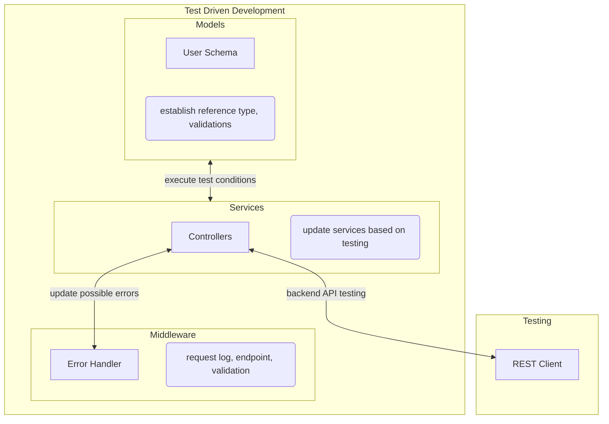
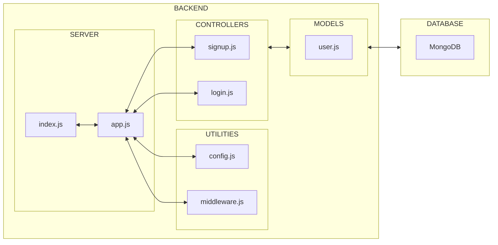

# Overview
- Implement user authentication
- Create RESTful API endpoints (`signup`, `login`)
- Integrate database for data persistence
- Refactor/reorganise codebase to follow MVC(Model-View-Controller) architecture

## Setup Local Database Server for Windows
- Install [MongoDB Community server](https://www.mongodb.com/try/download/community?tck=docs_server)
    - Install `.msi` or `.zip` based on your convenience
    - If installed `.msi` run the installation file from `cmd` terminal as Administrator
    - In 'Service Configuration', uncheck 'Install MongoD as a service' if you want to run the local development server manually (*I prefer this for development/testing phase*)
    - Install `Mongo Compass` if you prefer a GUI to manage databases and connection strings for them
    - After installation, go to default installation directory (`C:\Program Files`), find `MongoDB`
    - Keep opening the nested folders till you find `bin`
    - Copy the path, open the folder in the terminal as Administrator
        ```terminal
        C:\Windows\System32>cd C:\Program Files\MongoDB\Server\7.0\bin
        ```
    - Run the Database Server file (`mongod`) with paths defined for databases ( `dbpath` ) and logs ( `logpath` ) (*I prefer a different directoy, 'D:/'*)
        ```terminal
        C:\Program Files\MongoDB\Server\7.0\bin>mongod --dbpath D:\MongoDB\Server\7.0\data\db --logpath D:\MongoDB\Server\7.0\logs\mongod.log
        ```
    - *WIP* : ways to automate the server execution - bash script ?

# Process Flows
## Implementation of `signup`/`login` feature


<br>
<hr>

# Interactions between modules
