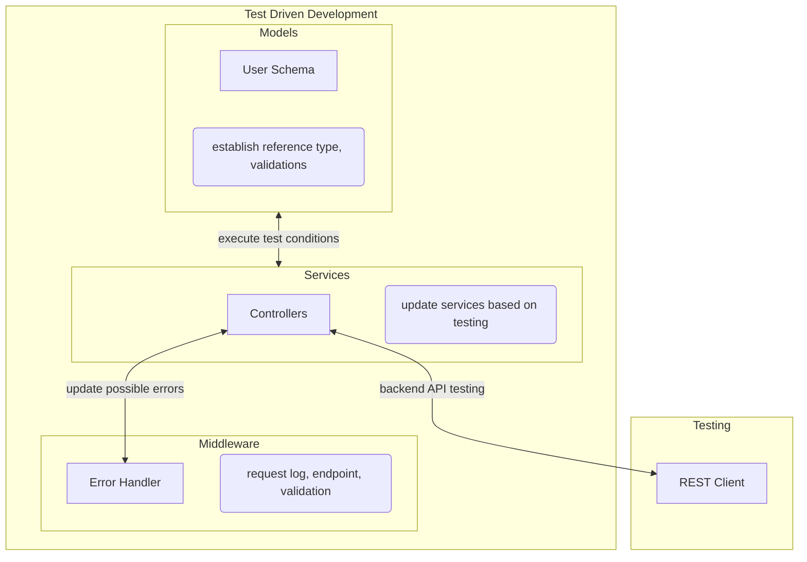
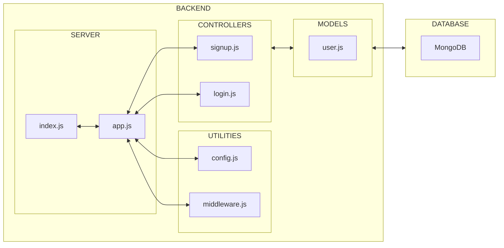

# Overview
- Implement user authentication
- Create RESTful API endpoints (`signup`, `login`)
- Integrate database for data persistence
- Refactor/reorganise codebase to follow MVC(Model-View-Controller) architecture

# Process Flows
## Implementation of `signup`/`login` feature

 

# Interactions between modules
